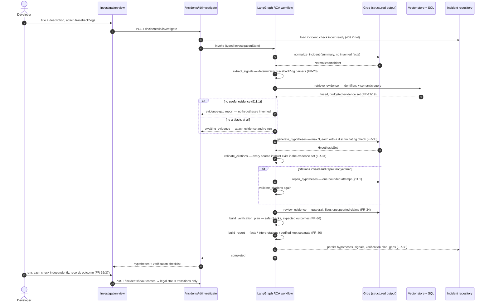

# IncidentGraph — System Architecture & Agent Workflow

Render this file's Mermaid blocks in [mermaid.live](https://mermaid.live), or
paste them into IncidentGraph's own chat (the assistant renders `mermaid`
blocks natively). The diagrams below mirror the **actual codebase** — module
names in the graph nodes match folders/classes in `backend/app/` and
`frontend/src/` — and the annotations reference the PRD requirements each
element satisfies.

## 1. System architecture (with the RCA agent workflow)

```mermaid
flowchart TB
    user["Developer (browser)"]

    subgraph FE["Frontend — React 18 + TypeScript strict + Tailwind · static build on Vercel"]
        direction LR
        intake["Landing / intake<br/>GitHub URL or ZIP<br/>privacy + scope notes"]
        progress["Ingestion progress<br/>trace-line loader, SSE-driven<br/>(FR-43 to FR-47)"]
        workspace["Repository workspace<br/>Markdown chat · citation chips<br/>Mermaid diagram boxes"]
        investigation["Investigation view<br/>hypothesis cards · evidence attach<br/>verification checklist"]
        report["Report view<br/>facts vs interpretations vs verified<br/>Markdown export (FR-39 to FR-42)"]
    end

    subgraph API["Backend — FastAPI · app/api/v1 · /api/v1 prefix"]
        health["GET /health"]
        repos_ep["POST/GET/DELETE /repositories<br/>normalize + SSRF fail-closed (FR-01)"]
        ingest_ep["POST /repositories/id/ingestions<br/>GET /jobs/id · GET /jobs/id/events SSE<br/>(FR-44)"]
        chat_ep["POST /repositories/id/chat<br/>POST /incidents/id/messages"]
        inc_ep["POST /repositories/id/incidents<br/>evidence · investigate · outcomes<br/>GET /incidents/id/report"]
        envelope["§8.6 error envelope<br/>code · message · request_id · retryable<br/>CORS pinned to FRONTEND_ORIGIN"]
    end

    subgraph SVC["Application services · app/services"]
        repo_svc["RepositoryService<br/>provenance + config fingerprint (FR-04)<br/>cascade delete (§6.1)"]
        ingest_svc["IngestionService + JobManager<br/>background thread · event ring buffer<br/>idempotent re-ingestion (FR-13)"]
        rag_svc["RagService<br/>bounded history (FR-21) · citation validation<br/>honest insufficiency (FR-24)"]
        inc_svc["IncidentService<br/>evidence artifacts kept separate (FR-27 to FR-29)"]
        runner["InvestigationRunner<br/>persists graph outputs (FR-37/38)"]
    end

    subgraph INGEST["Ingestion pipeline · app/ingestion — §9.1, runs in background thread"]
        direction LR
        p1["1 Validate"] --> p2["2 Fetch<br/>commit-SHA pinned"] --> p3["3 Extract sandboxed<br/>traversal · symlink · bomb guards"] --> p4["4 Discover<br/>deterministic order"] --> p5["5 Filter + secret scan<br/>(FR-07/FR-08)"] --> p6["6 Parse + chunk<br/>Python AST boundaries (FR-09)"] --> p7["7 Dedup<br/>content hashes (FR-13)"] --> p8["8 Embed<br/>bounded batches (FR-15)"] --> p9["9 Persist"] --> p10["10 Verify<br/>integrity gate → READY"]
    end

    subgraph RAG["Retrieval · app/retrieval — §10.1"]
        direction LR
        rewriter["query rewriter<br/>identifiers + paths (deterministic)"] --> dense["dense top-k<br/>repo + version filters"] --> fusion["reciprocal-rank fusion<br/>dedupe by chunk id"] --> builder["context builder<br/>strict token budget (FR-19)"]
    end

    subgraph AGENT["RCA agent workflow · app/agents — LangGraph, typed state (§11.2, FR-31/32)"]
        direction TB
        normalize["normalize_incident<br/>no unsupported facts"] --> sig["extract_signals<br/>deterministic parsers (FR-28)"] --> retrieve_ev["retrieve_evidence<br/>identifiers + semantic query"] --> gen["generate_hypotheses<br/>max 3, each with<br/>supporting + missing evidence<br/>+ discriminating check (FR-33)"] --> val_cit["validate_citations<br/>mechanical, FR-34"] --> review["review_evidence<br/>LLM guardrail, not proof (FR-34)"] --> vplan["build_verification_plan<br/>safe checks + expected outcomes<br/>never executes anything (FR-36)"] --> brep["build_report<br/>facts vs interpretations<br/>vs user-verified (FR-39/40)"]
        val_cit -. "invalid citations → one bounded repair, then partial (§11.1)" .-> repair["repair_hypotheses"] -.-> val_cit
        retrieve_ev -. "no useful evidence → gap report, never invented" .-> egap["evidence_gap"]
        normalize -. "no artifacts attached → stop and clarify" .-> awaiting["await_evidence<br/>user adds evidence, re-runs (FR-37)"]
        outcomes["user records outcome<br/>legal status transitions only (FR-35/37)"]
    end

    subgraph ADAPT["Infrastructure adapters — behind domain interfaces (§7.4, §14.3)"]
        direction LR
        groq["Groq ChatModel<br/>qwen chat model<br/>key = server-side secret only"]
        qwen_emb["Qwen3-Embedding-0.6B<br/>local or remote endpoint<br/>never via Groq (§14.2)"]
        chroma["Chroma VectorStore<br/>repo + index-version filters (FR-16)"]
        sqldb["SQL database<br/>SQLite dev, Postgres-ready (§13)"]
        ghub["GitHub API<br/>host allow-list, SHA pinned<br/>no code execution ever"]
    end

    user -->|"HTTPS"| FE
    intake --> repos_ep
    progress --> ingest_ep
    workspace --> chat_ep
    investigation --> inc_ep
    report --> inc_ep
    FE -. "CORS: FRONTEND_ORIGIN<br/>secrets never reach the browser (§6.1)" .-> API

    repos_ep --> repo_svc
    ingest_ep --> ingest_svc
    chat_ep --> rag_svc
    inc_ep --> inc_svc
    inc_ep --> runner

    ingest_svc --> INGEST
    rag_svc --> RAG
    runner --> AGENT
    inc_svc --> sqldb
    ingest_svc --> sqldb

    INGEST --> ghub
    INGEST --> qwen_emb
    INGEST --> chroma
    RAG --> chroma
    RAG --> groq
    AGENT --> groq
    AGENT --> chroma
    AGENT --> sqldb
```

### Reading the architecture

- **Dependency direction (PRD §7.4):** arrows always point from adapters/API
  toward the core — `API/UI → application services → domain contracts`. The
  domain (`app/domain/`) imports no framework or provider SDK; that rule is
  enforced by a test (`tests/unit/test_import_boundaries.py`).
- **Security boundaries (PRD §6.1):** secret scanning runs *before* chunking
  and embedding; archives are extracted into an isolated workspace and never
  executed; model/tensor binaries are excluded by extension; GitHub fetches
  are allow-listed against SSRF; the Groq key exists only as a server-side
  secret.
- **Honesty invariants:** the ingestion pipeline publishes a `ready` status
  only after the verify gate; the RAG service drops fabricated citations and
  reports insufficiency; the RCA graph stops for missing evidence rather than
  inventing hypotheses; no node ever emits a numerical confidence score
  (FR-24/FR-35/FR-44/FR-46).

## 2. Investigation sequence (the agent workflow in time)

## 3. Element-to-requirement map

| Diagram element | Code | PRD reference |
|---|---|---|
| Intake validation, SSRF allow-list | `core/security.py`, `api/v1/repositories.py` | FR-01, §6.1 |
| Sandboxed extraction, bomb guards | `ingestion/archive_extractor.py` | FR-02/03, §6.1 |
| Secret scan before chunking/embedding | `ingestion/secret_scanner.py` | FR-08 |
| Python AST chunking + fallbacks | `ingestion/parsers/`, `ingestion/chunkers/` | FR-09–12, §9.2 |
| Verify-before-ready | `ingestion/pipeline.py` stage 10 | §9.1 step 11, FR-46 |
| SSE progress, work-unit percent | `jobs/`, `api/v1/ingestion.py`, `ingestion/progress.py` | FR-43–47, §12.6 |
| Citation validation | `domain/policies.py`, `services/rag_service.py` | FR-20/24, §10.1 |
| RCA graph nodes + transitions | `agents/nodes.py`, `agents/transitions.py`, `agents/graph.py` | §11, FR-31–36, FR-38 |
| Qualitative statuses only | `domain/models.py` Hypothesis enum | FR-35 |
| Cascade delete | `services/repository_service.py` | §6.1 |
| Provider isolation | `domain/interfaces.py` + adapters | §7.4, §14.3 |
